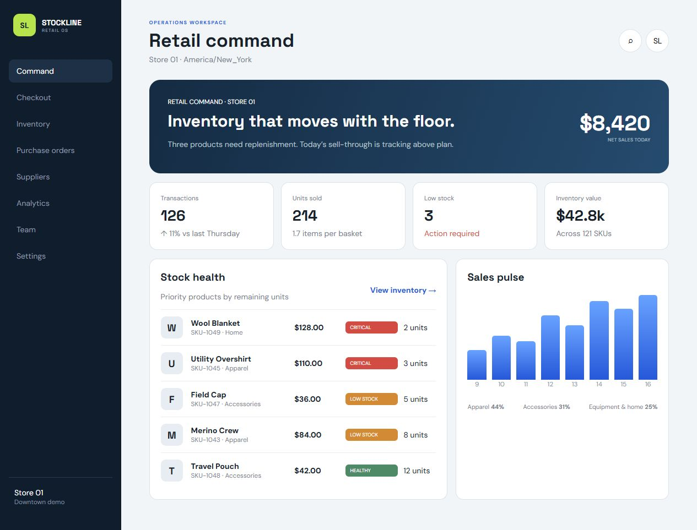
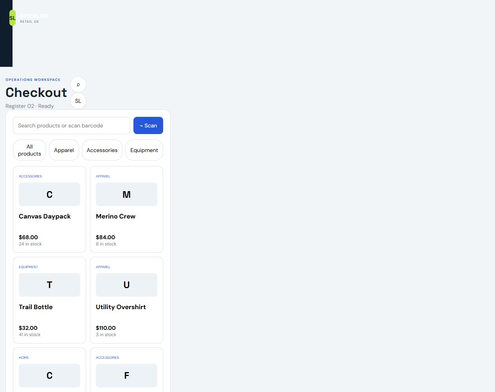
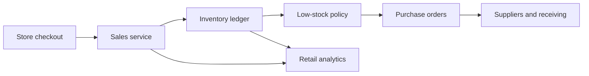

# Retail Inventory & POS — Portfolio Showcase

A portfolio-safe retail operating system demonstrating checkout, stock health, supplier activity, purchase orders, replenishment alerts, staff visibility, and commercial reporting.

## Product preview

| Retail command | Checkout |
| --- | --- |
|  |  |
| Inventory | Purchase orders |
|  |  |

The public repository contains a sanitized static demo and portfolio screenshots. The complete interactive source remains private. All products, SKUs, suppliers, employees, stock levels, prices, and results are fictional. No payment integration, card data, credential, customer record, or private API is included.

[Rico Integration](https://ricointegration.com/)
